# ChickInteL2026 Backend Schema Visual Comparison

Use this document to compare the database schema side-by-side with the implemented tables. Open the Mermaid preview in VS Code to see the visual ERD.

## How to use

1. Install the Mermaid preview extension in VS Code if not already installed.
2. Open this file.
3. Press `Ctrl+Shift+V` or use the command palette to open the Markdown preview.
4. If needed, use the Mermaid preview extension command to render the diagram.

## ERD Diagram

```mermaid
erDiagram
    PROFILES {
        uuid id PK
        text email
        text display_name
        uuid default_farm_id FK
        timestamptz created_at
    }
    FARMS {
        uuid id PK
        text name
        uuid owner_user_id FK
        timestamptz created_at
    }
    FARM_MEMBERS {
        uuid id PK
        uuid farm_id FK
        uuid user_id FK
        text role
        timestamptz created_at
    }
    BATCHES {
        uuid id PK
        uuid farm_id FK
        text batch_no
        text breed_name
        integer female_count
        integer male_count
        text age_label
        integer isolated_count
        integer killed_count
        text color_name
        text color_hex
        timestamptz created_at
        timestamptz updated_at
    }
    EGG_BATCHES {
        uuid id PK
        uuid farm_id FK
        text batch_no
        integer egg_qty
        integer line_no
        text age_unit
        integer hatched_qty
        integer damaged_qty
        integer unhatched_qty
        text color_name
        text color_hex
        text origin
        timestamptz created_at
        timestamptz updated_at
    }
    INVENTORY_ITEMS {
        uuid id PK
        uuid farm_id FK
        text item_type
        text item_name
        numeric qty
        text unit
        numeric price
        integer status_percent
        date purchased_date
        date delivered_date
        timestamptz created_at
        timestamptz updated_at
    }
    HEALTH_LOGS {
        uuid id PK
        uuid farm_id FK
        uuid disease_id FK
        text photo_uri
        text detected_illness
        text[] behavior_ids
        text result_summary
        text recommendation_text
        text action_status
        text duration_value
        text detection_source
        numeric confidence
        timestamptz saved_at
        timestamptz created_at
        timestamptz updated_at
    }
    SCAN_RECORDS {
        uuid id PK
        uuid farm_id FK
        uuid disease_id FK
        text scan_type
        text image_uri
        text breed_name
        text detected_illness
        jsonb raw_result
        numeric confidence
        timestamptz created_at
        timestamptz updated_at
    }
    SCHEDULE_TASKS {
        uuid id PK
        uuid farm_id FK
        text title
        time task_time
        text category
        text repeat_type
        text[] custom_repeat_days
        date start_date
        timestamptz created_at
        timestamptz updated_at
    }
    DISEASES {
        uuid id PK
        text slug
        text name
        text short_label
        text summary
        text severity
        text reference_source
        boolean is_active
        timestamptz created_at
        timestamptz updated_at
    }
    DISEASE_ALIASES {
        uuid id PK
        uuid disease_id FK
        text alias
        text alias_type
        timestamptz created_at
    }
    SYMPTOMS {
        uuid id PK
        text code
        text label
        text description
        text severity
        boolean is_active
        timestamptz created_at
    }
    DISEASE_SYMPTOMS {
        uuid id PK
        uuid disease_id FK
        uuid symptom_id FK
        numeric weight
        boolean is_primary
        timestamptz created_at
    }
    MEDICATIONS {
        uuid id PK
        text name
        text medication_type
        text notes
        boolean is_active
        timestamptz created_at
    }
    VITAMINS {
        uuid id PK
        text name
        text vitamin_type
        text notes
        boolean is_active
        timestamptz created_at
    }
    DISEASE_TREATMENTS {
        uuid id PK
        uuid disease_id FK
        text title
        text treatment_text
        uuid medication_id FK
        uuid vitamin_id FK
        integer sort_order
        timestamptz created_at
    }
    DISEASE_REFERENCE_IMAGES {
        uuid id PK
        uuid disease_id FK
        text image_path
        text image_caption
        text body_region
        text example_type
        timestamptz created_at
    }
    DISEASE_DETECTION_RULES {
        uuid id PK
        uuid disease_id FK
        text rule_name
        text[] required_symptom_codes
        text[] optional_symptom_codes
        text[] blocked_symptom_codes
        numeric min_score
        timestamptz created_at
    }

    PROFILES ||--o{ FARMS : "owner_user_id"
    PROFILES ||--o{ FARM_MEMBERS : "user_id"
    FARMS ||--o{ FARM_MEMBERS : "farm_id"
    FARMS ||--o{ BATCHES : "farm_id"
    FARMS ||--o{ EGG_BATCHES : "farm_id"
    FARMS ||--o{ INVENTORY_ITEMS : "farm_id"
    FARMS ||--o{ HEALTH_LOGS : "farm_id"
    FARMS ||--o{ SCAN_RECORDS : "farm_id"
    FARMS ||--o{ SCHEDULE_TASKS : "farm_id"
    DISEASES ||--o{ DISEASE_ALIASES : "disease_id"
    DISEASES ||--o{ DISEASE_SYMPTOMS : "disease_id"
    SYMPTOMS ||--o{ DISEASE_SYMPTOMS : "symptom_id"
    DISEASES ||--o{ DISEASE_TREATMENTS : "disease_id"
    MEDICATIONS ||--o{ DISEASE_TREATMENTS : "medication_id"
    VITAMINS ||--o{ DISEASE_TREATMENTS : "vitamin_id"
    DISEASES ||--o{ DISEASE_REFERENCE_IMAGES : "disease_id"
    DISEASES ||--o{ DISEASE_DETECTION_RULES : "disease_id"
    DISEASES ||--o{ HEALTH_LOGS : "disease_id"
    DISEASES ||--o{ SCAN_RECORDS : "disease_id"
```

## Comparison checklist

- `profiles` ⟷ `auth.users`
- `farms` ⟷ `profiles` owner relationship
- `farm_members` ⟷ membership bridge
- `batches`, `egg_batches`, `inventory_items`, `health_logs`, `scan_records`, `schedule_tasks` all linked to `farms`
- `health_logs` and `scan_records` can link to `diseases`
- Disease metadata is normalized through lookup tables: `symptoms`, `medications`, `vitamins`, `disease_aliases`, `disease_reference_images`, `disease_detection_rules`

## Exporting the ERD as PNG

1. Open `docs/ERD_COMPARISON.mmd` in VS Code.
2. Open the Mermaid preview with `Ctrl+Shift+V` or `Markdown: Open Preview to the Side`.
3. If your Mermaid preview extension supports export, use the preview toolbar or right-click menu to save as PNG.

Alternative CLI export:

- Run the helper script from the project root for normal resolution:
  - `powershell -ExecutionPolicy Bypass -File .\scripts\generate-erd-png.ps1`
- Run the high-resolution helper script from the project root:
  - `powershell -ExecutionPolicy Bypass -File .\scripts\generate-erd-png-highres.ps1`
- Or run directly using npx:
  - `npx --yes @mermaid-js/mermaid-cli -i docs/ERD_COMPARISON.mmd -o docs/ERD_COMPARISON.png`
- Or use the Windows wrapper command:
  - `.
scripts\generate-erd-png.cmd`

The generated PNG will be saved to `docs/ERD_COMPARISON.png`.

## Notes

- `egg_batches.batch_no` is stored as text and may need explicit batch linkage.
- `health_logs.behavior_ids` is currently an array, not a normalized child table.
- `scan_records.breed_name` is currently denormalized as a string.
