# ChickInteL2026 ERD Like Reference Image

This ERD follows the same style as your sample image: box-style tables with fields and visible table connections.

## Visual ERD

```mermaid
flowchart LR
    PROFILES["**profiles**<hr/>**PK** id<br/>email<br/>display_name<br/>default_farm_id<br/>created_at"]
    FARMS["**farms**<hr/>**PK** id<br/>name<br/>owner_user_id<br/>created_at"]
    FARM_MEMBERS["**farm_members**<hr/>**PK** id<br/>farm_id<br/>user_id<br/>role<br/>created_at"]

    BATCHES["**batches**<hr/>**PK** id<br/>farm_id<br/>batch_no<br/>breed_name<br/>female_count<br/>male_count<br/>age_label<br/>isolated_count<br/>killed_count<br/>color_name<br/>color_hex<br/>created_at<br/>updated_at"]
    EGG_BATCHES["**egg_batches**<hr/>**PK** id<br/>farm_id<br/>batch_no<br/>egg_qty<br/>line_no<br/>age_unit<br/>hatched_qty<br/>damaged_qty<br/>unhatched_qty<br/>origin<br/>created_at<br/>updated_at"]
    INVENTORY_ITEMS["**inventory_items**<hr/>**PK** id<br/>farm_id<br/>item_type<br/>item_name<br/>qty<br/>unit<br/>price<br/>status_percent<br/>purchased_date<br/>delivered_date<br/>created_at<br/>updated_at"]

    HEALTH_LOGS["**health_logs**<hr/>**PK** id<br/>farm_id<br/>disease_id<br/>photo_uri<br/>detected_illness<br/>behavior_ids<br/>result_summary<br/>recommendation_text<br/>action_status<br/>duration_value<br/>detection_source<br/>confidence<br/>saved_at"]
    SCAN_RECORDS["**scan_records**<hr/>**PK** id<br/>farm_id<br/>disease_id<br/>scan_type<br/>image_uri<br/>breed_name<br/>detected_illness<br/>raw_result<br/>confidence<br/>created_at<br/>updated_at"]
    SCHEDULE_TASKS["**schedule_tasks**<hr/>**PK** id<br/>farm_id<br/>title<br/>task_time<br/>category<br/>repeat_type<br/>custom_repeat_days<br/>start_date<br/>created_at<br/>updated_at"]

    DISEASES["**diseases**<hr/>**PK** id<br/>slug<br/>name<br/>short_label<br/>summary<br/>severity<br/>reference_source<br/>is_active<br/>created_at<br/>updated_at"]
    SYMPTOMS["**symptoms**<hr/>**PK** id<br/>code<br/>label<br/>description<br/>severity<br/>is_active<br/>created_at"]
    DISEASE_SYMPTOMS["**disease_symptoms**<hr/>**PK** id<br/>disease_id<br/>symptom_id<br/>weight<br/>is_primary<br/>created_at"]
    DISEASE_TREATMENTS["**disease_treatments**<hr/>**PK** id<br/>disease_id<br/>title<br/>treatment_text<br/>medication_id<br/>vitamin_id<br/>sort_order<br/>created_at"]
    MEDICATIONS["**medications**<hr/>**PK** id<br/>name<br/>medication_type<br/>notes<br/>is_active<br/>created_at"]
    VITAMINS["**vitamins**<hr/>**PK** id<br/>name<br/>vitamin_type<br/>notes<br/>is_active<br/>created_at"]

    PROFILES --- FARMS
    PROFILES --- FARM_MEMBERS
    FARMS --- FARM_MEMBERS

    FARMS --- BATCHES
    FARMS --- EGG_BATCHES
    FARMS --- INVENTORY_ITEMS
    FARMS --- HEALTH_LOGS
    FARMS --- SCAN_RECORDS
    FARMS --- SCHEDULE_TASKS

    DISEASES --- HEALTH_LOGS
    DISEASES --- SCAN_RECORDS

    DISEASES --- DISEASE_SYMPTOMS
    SYMPTOMS --- DISEASE_SYMPTOMS
    DISEASES --- DISEASE_TREATMENTS
    MEDICATIONS --- DISEASE_TREATMENTS
    VITAMINS --- DISEASE_TREATMENTS

    classDef user fill:#d9eaf7,stroke:#666,color:#111;
    classDef farm fill:#e8d8b8,stroke:#666,color:#111;
    classDef ops fill:#f7e6a7,stroke:#666,color:#111;
    classDef disease fill:#ead6f4,stroke:#666,color:#111;
    classDef master fill:#dceecd,stroke:#666,color:#111;

    class PROFILES,FARMS,FARM_MEMBERS user;
    class BATCHES,EGG_BATCHES,INVENTORY_ITEMS,HEALTH_LOGS,SCAN_RECORDS,SCHEDULE_TASKS ops;
    class DISEASES,DISEASE_SYMPTOMS,DISEASE_TREATMENTS disease;
    class SYMPTOMS,MEDICATIONS,VITAMINS master;
```

## Relationship Guide

Use these as the connector meanings:

- `profiles.id` -> `farms.owner_user_id`
- `profiles.id` -> `farm_members.user_id`
- `farms.id` -> `farm_members.farm_id`
- `farms.id` -> `batches.farm_id`
- `farms.id` -> `egg_batches.farm_id`
- `farms.id` -> `inventory_items.farm_id`
- `farms.id` -> `health_logs.farm_id`
- `farms.id` -> `scan_records.farm_id`
- `farms.id` -> `schedule_tasks.farm_id`
- `diseases.id` -> `health_logs.disease_id`
- `diseases.id` -> `scan_records.disease_id`
- `diseases.id` -> `disease_symptoms.disease_id`
- `symptoms.id` -> `disease_symptoms.symptom_id`
- `diseases.id` -> `disease_treatments.disease_id`
- `medications.id` -> `disease_treatments.medication_id`
- `vitamins.id` -> `disease_treatments.vitamin_id`

## Best One-Page Set

If you want the cleanest version closest to the sample image, use only these tables:

- `profiles`
- `farms`
- `farm_members`
- `batches`
- `egg_batches`
- `inventory_items`
- `health_logs`
- `scan_records`
- `diseases`
- `symptoms`
- `disease_symptoms`
- `disease_treatments`
