# ChickInteL2026 ERD

This ERD is based on the Supabase schema used by the app under `app/`, `providers/`, and `utils/`.

## Main ERD

```mermaid
erDiagram
    AUTH_USERS {
        uuid id PK
    }

    PROFILES {
        uuid id PK, FK
        text email UK
        text display_name
        uuid default_farm_id FK
        timestamptz created_at
    }

    FARMS {
        uuid id PK
        text name
        uuid owner_user_id FK
        timestamptz created_at
    }

    FARM_MEMBERS {
        uuid id PK
        uuid farm_id FK
        uuid user_id FK
        text role
        timestamptz created_at
    }

    BREEDS {
        uuid id PK
        text name UK
        text category
        text temperament
        text purpose
        boolean is_active
        timestamptz created_at
    }

    FEED_TYPES {
        uuid id PK
        text name UK
        text description
        boolean is_active
        timestamptz created_at
    }

    INVENTORY_CATEGORIES {
        uuid id PK
        text name UK
        text description
        boolean is_active
        timestamptz created_at
    }

    SYMPTOMS {
        uuid id PK
        text code UK
        text label UK
        text description
        text severity
        boolean is_active
        timestamptz created_at
    }

    MEDICATIONS {
        uuid id PK
        text name UK
        text medication_type
        text notes
        boolean is_active
        timestamptz created_at
    }

    VITAMINS {
        uuid id PK
        text name UK
        text vitamin_type
        text notes
        boolean is_active
        timestamptz created_at
    }

    BATCHES {
        uuid id PK
        uuid farm_id FK
        text batch_no
        text breed_name
        int female_count
        int male_count
        text age_label
        int isolated_count
        int killed_count
        text color_name
        text color_hex
        timestamptz created_at
        timestamptz updated_at
    }

    EGG_BATCHES {
        uuid id PK
        uuid farm_id FK
        text batch_no
        int egg_qty
        int line_no
        text age_unit
        int hatched_qty
        int damaged_qty
        int unhatched_qty
        text color_name
        text color_hex
        text origin
        timestamptz created_at
        timestamptz updated_at
    }

    INVENTORY_ITEMS {
        uuid id PK
        uuid farm_id FK
        text item_type
        text item_name
        numeric qty
        text unit
        numeric price
        int status_percent
        date purchased_date
        date delivered_date
        timestamptz created_at
        timestamptz updated_at
    }

    HEALTH_LOGS {
        uuid id PK
        uuid farm_id FK
        uuid disease_id FK
        text photo_uri
        text detected_illness
        text[] behavior_ids
        text result_summary
        text recommendation_text
        text action_status
        text duration_value
        text detection_source
        numeric confidence
        timestamptz saved_at
        timestamptz created_at
        timestamptz updated_at
    }

    SCAN_RECORDS {
        uuid id PK
        uuid farm_id FK
        uuid disease_id FK
        text scan_type
        text image_uri
        text breed_name
        text detected_illness
        jsonb raw_result
        numeric confidence
        timestamptz created_at
        timestamptz updated_at
    }

    SCHEDULE_TASKS {
        uuid id PK
        uuid farm_id FK
        text title
        time task_time
        text category
        text repeat_type
        text[] custom_repeat_days
        date start_date
        timestamptz created_at
        timestamptz updated_at
    }

    DISEASES {
        uuid id PK
        text slug UK
        text name UK
        text short_label
        text summary
        text severity
        text reference_source
        boolean is_active
        timestamptz created_at
        timestamptz updated_at
    }

    DISEASE_ALIASES {
        uuid id PK
        uuid disease_id FK
        text alias
        text alias_type
        timestamptz created_at
    }

    DISEASE_SYMPTOMS {
        uuid id PK
        uuid disease_id FK
        uuid symptom_id FK
        numeric weight
        boolean is_primary
        timestamptz created_at
    }

    DISEASE_TREATMENTS {
        uuid id PK
        uuid disease_id FK
        uuid medication_id FK
        uuid vitamin_id FK
        text title
        text treatment_text
        int sort_order
        timestamptz created_at
    }

    DISEASE_REFERENCE_IMAGES {
        uuid id PK
        uuid disease_id FK
        text image_path
        text image_caption
        text body_region
        text example_type
        timestamptz created_at
    }

    DISEASE_DETECTION_RULES {
        uuid id PK
        uuid disease_id FK
        text rule_name
        text[] required_symptom_codes
        text[] optional_symptom_codes
        text[] blocked_symptom_codes
        numeric min_score
        timestamptz created_at
    }

    AUTH_USERS ||--|| PROFILES : "has profile"
    PROFILES ||--o{ FARMS : "owns"
    FARMS ||--o{ FARM_MEMBERS : "has members"
    PROFILES ||--o{ FARM_MEMBERS : "joins"
    PROFILES o|--o| FARMS : "default farm"

    FARMS ||--o{ BATCHES : "contains"
    FARMS ||--o{ EGG_BATCHES : "contains"
    FARMS ||--o{ INVENTORY_ITEMS : "stocks"
    FARMS ||--o{ HEALTH_LOGS : "records"
    FARMS ||--o{ SCAN_RECORDS : "stores"
    FARMS ||--o{ SCHEDULE_TASKS : "schedules"

    DISEASES ||--o{ DISEASE_ALIASES : "has"
    DISEASES ||--o{ DISEASE_SYMPTOMS : "maps"
    SYMPTOMS ||--o{ DISEASE_SYMPTOMS : "used in"
    DISEASES ||--o{ DISEASE_TREATMENTS : "has"
    MEDICATIONS o|--o{ DISEASE_TREATMENTS : "optional"
    VITAMINS o|--o{ DISEASE_TREATMENTS : "optional"
    DISEASES ||--o{ DISEASE_REFERENCE_IMAGES : "has"
    DISEASES ||--o{ DISEASE_DETECTION_RULES : "has"

    DISEASES o|--o{ HEALTH_LOGS : "detected in"
    DISEASES o|--o{ SCAN_RECORDS : "detected in"
```

## Reporting Layer

The reporting module is derived from operational tables, not separate transactional tables:

- `report_batch_daily_summary` comes from `batches`
- `report_egg_daily_summary` comes from `egg_batches`
- `report_inventory_daily_summary` comes from `inventory_items`
- `get_report_totals(farm_id, start_date, end_date)` aggregates those views

## Notes

- `profiles.id` is both the PK and an FK to `auth.users.id`.
- `farm_members` is the bridge table between users and farms.
- `disease_symptoms` is the many-to-many bridge between `diseases` and `symptoms`.
- `health_logs.behavior_ids` stores symptom codes as a text array instead of linking to a junction table.
- `batches.breed_name` and `inventory_items.item_type` are stored as text, even though lookup tables exist for breeds, feed types, and inventory categories.
- `scan_records` is an audit/history table for scan results; health journal saves also create a `scan_records` row.
