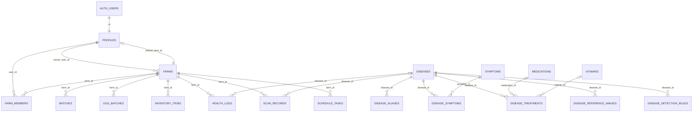

# ChickInteL2026 Actual ERD

This version is focused on table connections so you can clearly see which table links to which.

## Connected ERD



## Main Tables

### User and Farm Side

```text
AUTH_USERS
  id (PK)
      |
      | 1:1
      v
PROFILES
  id (PK, FK -> auth_users.id)
  default_farm_id (FK -> farms.id)
      |
      | 1:M owner_user_id
      v
FARMS
  id (PK)
  owner_user_id (FK -> profiles.id)
      |
      | 1:M
      v
FARM_MEMBERS
  id (PK)
  farm_id (FK -> farms.id)
  user_id (FK -> profiles.id)
```

### Farm Operation Side

```text
FARMS
  id (PK)
   |----< BATCHES.farm_id
   |----< EGG_BATCHES.farm_id
   |----< INVENTORY_ITEMS.farm_id
   |----< HEALTH_LOGS.farm_id
   |----< SCAN_RECORDS.farm_id
   |----< SCHEDULE_TASKS.farm_id
```

### Disease Knowledge Side

```text
DISEASES
  id (PK)
   |----< DISEASE_ALIASES.disease_id
   |----< DISEASE_SYMPTOMS.disease_id >----| SYMPTOMS.id
   |----< DISEASE_TREATMENTS.disease_id
   |----< DISEASE_REFERENCE_IMAGES.disease_id
   |----< DISEASE_DETECTION_RULES.disease_id
   |----< HEALTH_LOGS.disease_id
   |----< SCAN_RECORDS.disease_id

DISEASE_TREATMENTS
  medication_id -> MEDICATIONS.id
  vitamin_id -> VITAMINS.id
```

## Foreign Key Map

| Table | Foreign Key | References |
|---|---|---|
| `profiles` | `id` | `auth.users.id` |
| `profiles` | `default_farm_id` | `farms.id` |
| `farms` | `owner_user_id` | `profiles.id` |
| `farm_members` | `farm_id` | `farms.id` |
| `farm_members` | `user_id` | `profiles.id` |
| `batches` | `farm_id` | `farms.id` |
| `egg_batches` | `farm_id` | `farms.id` |
| `inventory_items` | `farm_id` | `farms.id` |
| `health_logs` | `farm_id` | `farms.id` |
| `health_logs` | `disease_id` | `diseases.id` |
| `scan_records` | `farm_id` | `farms.id` |
| `scan_records` | `disease_id` | `diseases.id` |
| `schedule_tasks` | `farm_id` | `farms.id` |
| `disease_aliases` | `disease_id` | `diseases.id` |
| `disease_symptoms` | `disease_id` | `diseases.id` |
| `disease_symptoms` | `symptom_id` | `symptoms.id` |
| `disease_treatments` | `disease_id` | `diseases.id` |
| `disease_treatments` | `medication_id` | `medications.id` |
| `disease_treatments` | `vitamin_id` | `vitamins.id` |
| `disease_reference_images` | `disease_id` | `diseases.id` |
| `disease_detection_rules` | `disease_id` | `diseases.id` |

## Simplified ERD for Presentation

If you want to present this in class or in your thesis, this is the simplest structure:

```text
AUTH_USERS -> PROFILES -> FARMS -> {BATCHES, EGG_BATCHES, INVENTORY_ITEMS, HEALTH_LOGS, SCAN_RECORDS, SCHEDULE_TASKS}

PROFILES -> FARM_MEMBERS <- FARMS

DISEASES -> {DISEASE_ALIASES, DISEASE_SYMPTOMS, DISEASE_TREATMENTS, DISEASE_REFERENCE_IMAGES, DISEASE_DETECTION_RULES}
SYMPTOMS -> DISEASE_SYMPTOMS
MEDICATIONS -> DISEASE_TREATMENTS
VITAMINS -> DISEASE_TREATMENTS
DISEASES -> {HEALTH_LOGS, SCAN_RECORDS}
```
